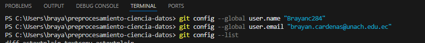
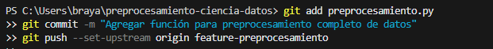
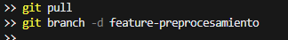
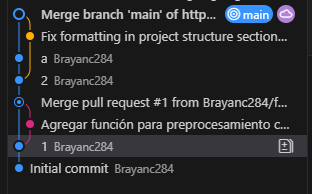

## Proyecto: Preprocesamiento de Ciencia de Datos
## Objetivo 
## Este proyecto tiene como objetivo aplicar técnicas básicas de **control de versiones** utilizando Git y GitHub, además de implementar un flujo de trabajo automatizado mediante **GitHub Actions (CI/CD)**.  

## El proyecto incluye la creación de ramas, commits, fusión (Pull Request) y automatización de tareas con workflows.

### Funcionalidades implementadas:
- Creación y gestión de ramas (`feature-preprocesamiento`).
- Script en Python para preprocesar datasets (`preprocesamiento.py`).
- Archivo `.gitignore` configurado para evitar subir archivos innecesarios.
- Implementación de un flujo de trabajo CI en GitHub Actions.

## Comandos utlizados 
omandos Git usados

| Comando | Descripción |
|----------|--------------|
| `git init` | Inicializa un nuevo repositorio local de Git. |
| `git status` | Muestra el estado de los archivos (modificados, agregados, etc.). |
| `git add .` | Agrega los cambios al área de preparación (staging). |
| `git commit -m "mensaje"` | Guarda los cambios con un mensaje descriptivo. |
| `git branch nombre-rama` | Crea una nueva rama. |
| `git checkout nombre-rama` | Cambia a una rama específica. |
| `git push origin nombre-rama` | Envía los cambios de una rama al repositorio remoto. |
| `git merge nombre-rama` | Fusiona los cambios de una rama en otra. |
| `git pull` | Actualiza el repositorio local con los cambios remotos. |
| `git log` | Muestra el historial de commits realizados. |

## Automatización con GitHub Actions
Se implementó un flujo de trabajo (work flow) en GitHub Actions para realizar Integración Continua (CI).  
Este flujo automatiza la instalación de dependencias y la ejecución de pruebas básicas al realizar cambios en la rama `main`.

**Ubicación del archivo YAML:**  
`.github/workflows/ci.yml`

### **Código del workflow:**
```yaml
name: CI

on:
  push:
    branches:
      - main

jobs:
  test:
    runs-on: ubuntu-latest
    steps:
      - name: Checkout code
        uses: actions/checkout@v2

      - name: Set up Python
        uses: actions/setup-python@v2
        with:
          python-version: '3.9'

      - name: Install dependencies
        run: pip install -r requirements.txt || echo "No requirements file found"

      - name: Run tests
        run: echo "Simulación de pruebas automatizadas exitosas"




    